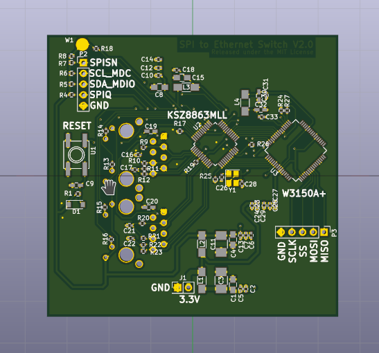
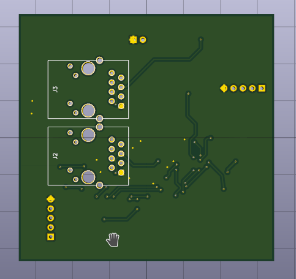

# spi_to_ethernet_switch
Hardware and software for an Ethernet Switch with an MII to SPI adapter on it.

## Description

This project has 2 parts; a Kicad Project containing the schematic and layout for the board, and the software to interact 
with the board.  The idea was to create a compact ethernet switch suitable for use with low power microcontrollers and single 
board computers.  Micrel produces several ethernet switches in the same family with more ports and this design would make a good 
starting point for using those.

## Kicad Project

The main components of this project are the [Micrel KSZ8863MLL](https://www.microchip.com/wwwproducts/en/KSZ8863) 3 Port Ethernet Switch and the Wiznet W3150A+ Ethernet MAC to SPI Adapter.
The KSZ8863MLL provides 3 ethernet interfaces.  The first 2 include the PHYs and are connected to RJ45 connectors with included magnetics.
The other interface is connected via the MII interface to the [W3150A+](http://www.wiznet.io/product-item/w3150a/).  The SPI pins on W3150A+ are broken out on the board so that they
may be attached to a microcontroller or single board computer.  All of the examples in this project use a Raspberry Pi 2.

## Software

The software is located in the [code](/code) directory.  This was written for the Raspberry Pi 2 and it is easiest to compile it
on the raspberry pi.  Once it is there, run the makefile in the [src](/code/src) directory.  This creates three executables:
  * tx_example: transmits a raw ethernet frame once a second
  * recv_example: receives raw ethernet frames and prints them as they arrive
  * tap_example: uses the tap interface on the Raspberry Pi to send and receive raw ethernet frames over the SPI interface
  
The W3150A+ offers TCP/IP processing onboard.  Depending on the situation, it might be advantageous to make use of that functionality.
The existing SPI connection will support this.
